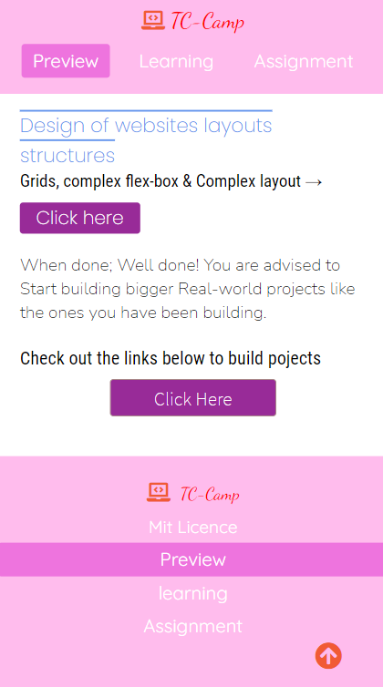
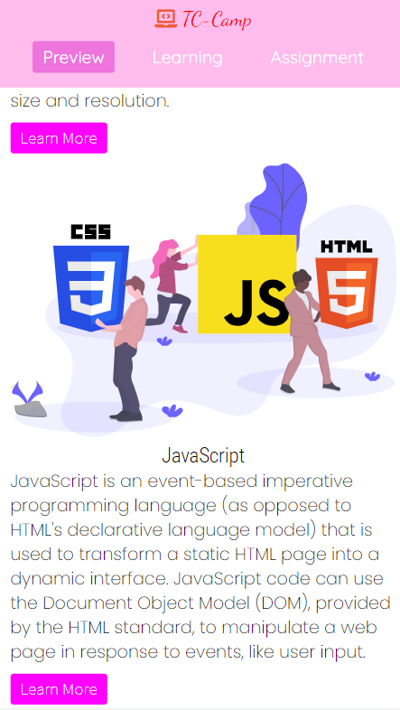
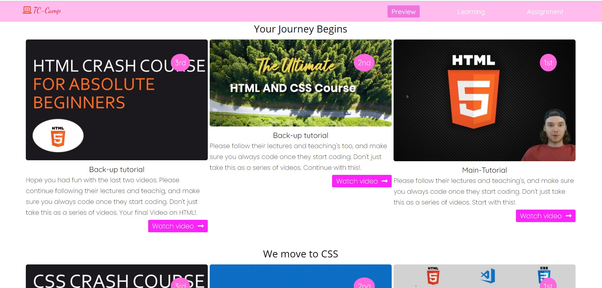
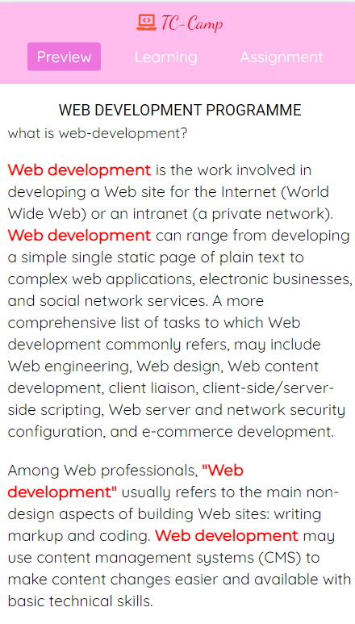

 # GUIDE FOR WEB DEVELOPMENT(FRONT END DEVELOPMENT IN PARTICULAR).

 ## Welcome!

 ##let's get started.

 Thank you for checking this work.

 ## About This Work:
   This is a Beutiful website, which is showcasing different types of design layout and patterns. Firstly this beautiful work is for practsing on understanding and broadening of the CSS Grids, flexbox and CSS position Property. Little JS(Java-script) class fuctions were used to provide fuctionality to basic inputs. Also this project is for the purpose of guiding those with little or no experience with WEB-DEVELOPMENT to kick start thier journey.

## pictures of this Work
 ##An Example##

 ##process##
      THIS FILE IS FOR THE PRACTISE OF HTML(DEEPER)
 -PRACTISE FOR THE BUILDING OF MODERN SEMANTIC WEBSITE
 -STRUCTURES OF DIFFERENT , AND PROPER DISPLAY OF MARKUP'S IN A CONTAINER.
 -PRACTISED PROPER INTERNAL LINKING OF PAGES WITHIN A CONTAINER.

    THIS FILE IS FOR THE PRACTISE OF CSS
 -PRACTISED USING GRIDS TO ENSURE PROPER LAYOUT AND STRUCTURE OF WEBSITE PROPERLY.
 -PRACTISED USING FLEX-BOX AND QUERIES TO ENSURE ALL BREAKPOINTS WERE MET, TO ATTAIN A FULY RESPONSIVE WORK.
 -PRACTISED USING THE POSITION PROPERTY TO YIELD OUT A BEAUTIFUL LAYOUT OF DIFFERENT SECTIONS.
 -PRACTISED USING PROPER FONTS AND FONT-SIZES TO ENSURE BEAUTIFUL OUTCOME OF TEXT TEXTURES IN HTML.

 ##Larger screen sizes##

 ##smaller screen sizes##

##Check out this Road-Map which will serve as a guide##

  ## Built with         
      -HTML(Hypertext Mark-up Language)
      -CSS(Cascading Styles Sheet)
      -JS(Java-Script)

  ## My Challanges and lessons
  Ensured proper linking from external Sites and also internal linkings too, Researched enough to provide very useful informations to various beautiful persons out there looking to start up their Web-development journey.

   ## Installations
   -For those Farmiliar with Git-hub you can clone the repo and pull to your local workplace to view.

   -For those who want to check the work rom the site, click here [https://app.netlify.com/sites/infallible-bhaskara-e68e02], to view Thank you once again.

   ## Best syntax Used

    ``CSS
   (Hover-Effect), (flex-box), and (power of proper font usage).
  Hover is very important for efficient change-overs to improve the outlook of a website. and also really loved the css grids for easy and effective layout of sections properly.
   ``

   ## Resources that helped ##
   -For the Colors[https://htmlcolorcodes.com/color-names/]

   -For the icons[https://fontawesome.com/]

   -For the Fonts[https://fonts.google.com/]

 ## Licsense 
   This work is under [MIT] liscence. It's highly free and opensource to anyone.